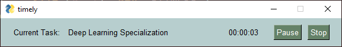

# timely

A very simple time tracker. It's not the prettiest UI or the cleanest code, but it works for my uses.

## features
- Tracks time spent on **one** task at a time (by design)
- Outputs time spent on task to csv file when task is complete

## dependencies
- python
- PySimpleGUI